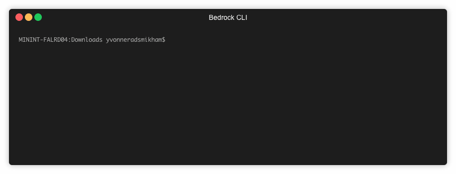

# Bedrock CLI
[](https://dev.azure.com/epicstuff/bedrock-cli/_build/latest?definitionId=106&branchName=master)
[](https://goreportcard.com/report/github.com/yradsmikham/bedrock-cli)


Bedrock CLI is an open-source project that was developed to supplement Project Bedrock. It is a wrapper for `terraform`, `az` cli, and `kubectl` in order to extend features in Bedrock.

This command line tool will help simplify the automation and management of your Kubernetes resource deployments across clusters and environments, allowing you to rollout processes and find deployment issues more quickly.

## Prerequisites
  1. Azure Subscription
  2. Azure CLI
  3. Terraform
  4. Kubectl
  5. Service Principal

## Objective

Bedrock CLI aims to achieve the following:

  1. Accelerate the upskilling required to onboard onto Bedrock.
  2. More scripting and automation around cluster creation, deletion, or updates for development purposes.

## Getting Started

Install the latest Bedrock CLI on your local machine from the releases, unzipping the appropriate binary and placing the bedrock executable in your path. The Bedrock cli tool, azure cli, terraform, and git are the only tools you need to have installed.

You can spin up a Bedrock Azure Simple cluster by running the following command:

```
bedrock demo --sp <service principal id> --secret <password for the service principal id> --gitops-ssh-url <manifest repo url in ssh format>
```

`demo` is a quick and easy command that does the following:

1. Verifies that the prerequisites are all installed in your local environment.
2. Verifies that the Bedrock repo is already cloned in your current working directory.
3. Makes a copy of the Bedrock `azure-simple` environment.
4. Populates the variables required for the `azure-simple` environment (generates a `bedrock-config.tfvars`).
5. Generates new SSH Keys for the new `azure-simple` environment.
6. Configures Flux to sync with the specified materialized manifest repo (provided by `--gitops-ssh-url`).
7. Executes `terraform init`.
8. Executes `terraform plan`
9. Executes `terraform apply`.
10. Adds the newly created Bedrock Azure Simple Cluster to your local KUBECONFIG file.



If you would like to deploy an `azure-simple` cluster with _custom_ variables:

```
bedrock azure-simple --sp <service principal id> --secret <password for the service principal id> --gitops-ssh-url <manifest repo url in ssh format> [--cluster-name <name of AKS cluster>]
```

The following variables are (currently) supported:
- `cluster-name`: Name of the Kubernetes cluster you want to create.
- `gitops-ssh-url`: The git repo that contains the resource manifests that should be deployed in the cluster in ssh formate (e.g. git@github.com:timfpark/fabrikate-cloud-native-manifests.git). This repo must have a deployment key configured to accept changes, which the CLI will generate for you.

The Bedrock CLI also supports other environments such as `azure-common-infra`, `azure-single-keyvault`, and `azure-multiple-clusters`. Check out `bedrock info <environment>` for more information on how to create these environments with the CLI.
