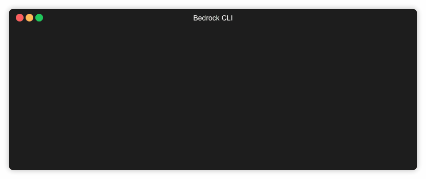

# Bedrock CLI

Bedrock CLI is an open-source project that was developed to supplement Project Bedrock. It is a wrapper for `terraform`, `az` cli, and `kubectl` in order to extend features in Bedrock.

This command line tool will help simplify the automation and management of your Kubernetes resource deployments across clusters and environments, allowing you to rollout processes and find deployment issues more quickly.

## Prerequisites
  1. Azure Subscription
  2. Azure CLI
  3. terraform
  4. kubectl

## Objective

Bedrock CLI aims to achieve the following:

  1. Accelerate the upskilling required to onboard onto Bedrock.
  2. More scripting and automation around cluster creation, deletion, or updates for development purposes.

## Design

## Installation

Install the latest Bedrock CLI on your local machine from the releases, unzipping the appropriate binary and placing br in your path. The br cli tool, azure cli, terraform, and git are the only tools you need to have installed.
